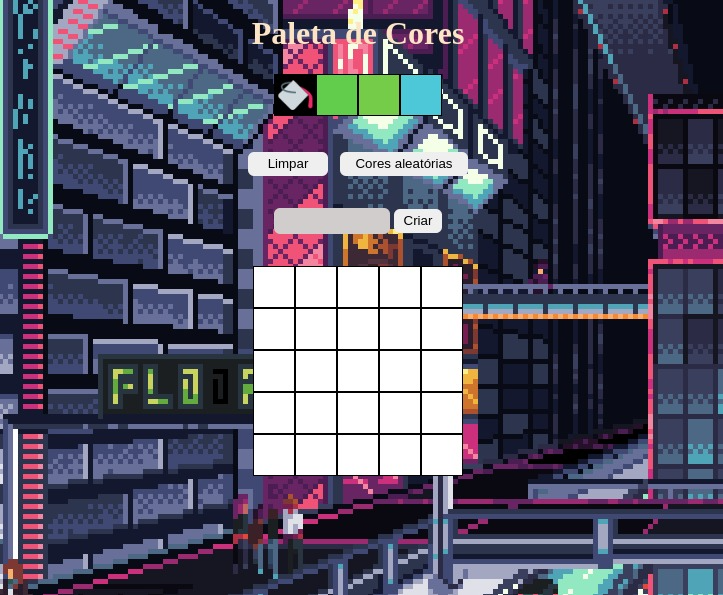

# Pixel Art



# Tecnologias utilizadas


# Índice

* [Título e Imagens Home](#pixel-art)
* [tecnologias utilizadas](#tecnologias-utilizadas)
* [Índice](#índice)
* [Descrição do projeto](#descrição-do-projeto)
* [Status do Projeto](#status-do-projeto)
* [Funcionalidade do projeto](#🔨-funcionalidade-do-projeto)
* [Acesso ao Projeto](#acesso-ao-projeto)

# Descrição do Projeto

Projeto desenvolvido na escola [Trybe](https://www.betrybe.com/), nele é possível gerar cores, limpar o quadro e escolher o tamanho dele.

# Status do Projeto

> 💹 Alpha 💹

# 🔨 Funcionalidade do projeto

- escolher o tamanho do quadro
- gera cores aleatórias
- limpa o quadro

# Acesso ao projeto

você precisa ter Instalado o npm e o nodejs.

1. Clone o Projeto

```bash
git clone https://github.com/EversonDias/Project_Trybe_HTML_CSS_and_JavaScript_Pixel_Art.git PixelArt
```

2. Entre no projeto

```bash
cd PixelArt
```

3. inicie o projeto

```bash
npm start
```
